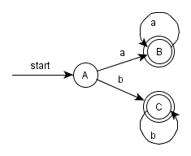
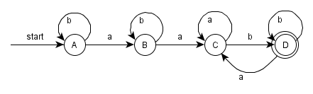
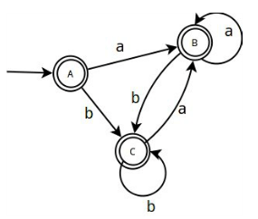
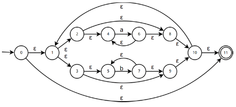
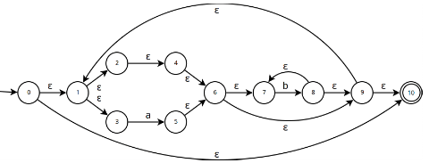
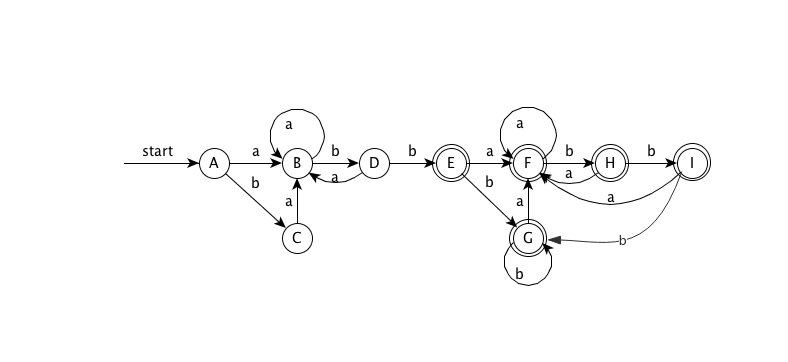

# Exercises for Section 3.7

### 3.7.1

Convert to DFA's the NFA's of:

1. Fig. 3.26.
2. Fig. 3.29.
3. Fig. 3.30.

#### Answer

1、

**Transition table**

<table>
	<thead>
		<tr>
			<th>NFA State</th>
			<th>DFA State</th>
			<th>a</th>
			<th>b</th>
		</tr>
	</thead>
	<tbody>
		<tr>
			<td>{0,1,3}</td>
			<td>A</td>
			<td>B</td>
			<td>C</td>
		</tr>
		<tr>
			<td>{2}</td>
			<td>B</td>
			<td>B</td>
			<td>∅</td>
		</tr>
		<tr>
			<td>{4}</td>
			<td>C</td>
			<td>∅</td>
			<td>C</td>
		</tr>
	</tbody>
</table>

**DFA**

2、

**Transition table**

<table>
	<thead>
		<tr>
			<th>NFA State</th>
			<th>DFA State</th>
			<th>a</th>
			<th>b</th>
		</tr>
	</thead>
	<tbody>
		<tr>
			<td>{0}</td>
			<td>A</td>
			<td>B</td>
			<td>A</td>
		</tr>
		<tr>
			<td>{0,1}</td>
			<td>B</td>
			<td>C</td>
			<td>B</td>
		</tr>
		<tr>
			<td>{0,1,2}</td>
			<td>C</td>
			<td>C</td>
			<td>D</td>
		</tr>
		<tr>
			<td>{0,2,3}</td>
			<td>D</td>
			<td>C</td>
			<td>D</td>
		</tr>
	</tbody>
</table>

**DFA**

3、

**Transition table**

<table>
	<thead>
		<tr>
			<th>NFA State</th>
			<th>DFA State</th>
			<th>a</th>
			<th>b</th>
		</tr>
	</thead>
	<tbody>
		<tr>
			<td>{0,1,2,3}</td>
			<td>A</td>
			<td>A</td>
			<td>A</td>
		</tr>
	</tbody>
</table>

**DFA**

### 3.7.2

use Algorithm 3.22 to simulate the NFA's:

1. Fig. 3.29.
2. Fig. 3.30.

on input aabb.

#### Answer

1. -start->{0}-a->{0,1}-a->{0,1,2}-b->{0,2,3}-b->{0,2,3}
2. -start->{0,1,2,3}-a->{0,1,2,3}-a->{0,1,2,3}-b->{0,1,2,3}-b->{0,1,2,3}

### 3.7.3

Convert the following regular expressions to deterministic finite automata, using algorithms 3.23 and 3.20:

1. (a|b)\*
2. (a\*|b\*)\*
3. ((ε|a)|b\*)\*
4. (a|b)\*abb(a|b)\*

#### Answer

1、

**NFA**

**Transition table**

<table>
	<thead>
		<tr>
			<th>NFA State</th>
			<th>DFA State</th>
			<th>a</th>
			<th>b</th>
		</tr>
	</thead>
	<tbody>
		<tr>
			<td>{0,1,2,3,7}</td>
			<td>A</td>
			<td>B</td>
			<td>C</td>
		</tr>
		<tr>
			<td>{1,2,3,4,6,7}</td>
			<td>B</td>
			<td>B</td>
			<td>C</td>
		</tr>
		<tr>
			<td>{1,2,3,5,6,7}</td>
			<td>C</td>
			<td>B</td>
			<td>C</td>
		</tr>
	</tbody>
</table>

**DFA**

2、

**NFA**

**Transition table**

<table>
	<thead>
		<tr>
			<th>NFA State</th>
			<th>DFA State</th>
			<th>a</th>
			<th>b</th>
		</tr>
	</thead>
	<tbody>
		<tr>
			<td>{0,1,2,3,4,5,8,9,10,11}</td>
			<td>A</td>
			<td>B</td>
			<td>C</td>
		</tr>
		<tr>
			<td>{1,2,3,4,5,6,8,9,10,11}</td>
			<td>B</td>
			<td>B</td>
			<td>C</td>
		</tr>
		<tr>
			<td>{1,2,3,4,5,7,8,9,10,11}</td>
			<td>C</td>
			<td>B</td>
			<td>C</td>
		</tr>
	</tbody>
</table>

**DFA**

3、

**NFA**

**Transition table**

<table>
	<thead>
		<tr>
			<th>NFA State</th>
			<th>DFA State</th>
			<th>a</th>
			<th>b</th>
		</tr>
	</thead>
	<tbody>
		<tr>
			<td>{0,1,2,3,4,6,7,9,10}</td>
			<td>A</td>
			<td>B</td>
			<td>C</td>
		</tr>
		<tr>
			<td>{1,2,3,4,5,6,7,9,10}</td>
			<td>B</td>
			<td>B</td>
			<td>C</td>
		</tr>
		<tr>
			<td>{1,2,3,4,6,7,8,9,10}</td>
			<td>C</td>
			<td>B</td>
			<td>C</td>
		</tr>
	</tbody>
</table>

**DFA**

4、

**NFA**

**Transition table**

<table>
	<thead>
		<tr>
			<th>NFA State</th>
			<th>DFA State</th>
			<th>a</th>
			<th>b</th>
		</tr>
	</thead>
	<tbody>
		<tr>
			<td>{0,1,2,4,7}</td>
			<td>A</td>
			<td>B</td>
			<td>C</td>
		</tr>
		<tr>
			<td>{1,2,3,4,6,7,8}</td>
			<td>B</td>
			<td>B</td>
			<td>D</td>
		</tr>
		<tr>
			<td>{1,2,4,5,6,7}</td>
			<td>C</td>
			<td>B</td>
			<td>C</td>
		</tr>
		<tr>
			<td>{1,2,4,5,6,7,9}</td>
			<td>D</td>
			<td>B</td>
			<td>E</td>
		</tr>
		<tr>
			<td>{1,2,4,5,6,7,10,11,12,14,17}</td>
			<td>E</td>
			<td>F</td>
			<td>G</td>
		</tr>
		<tr>
			<td>{1,2,3,4,6,7,8,11,12,13,14,16,17}</td>
			<td>F</td>
			<td>F</td>
			<td>H</td>
		</tr>
		<tr>
			<td>{1,2,4,5,6,7,11,12,13,15,16,17}</td>
			<td>G</td>
			<td>F</td>
			<td>G</td>
		</tr>
		<tr>
			<td>{1,2,4,5,6,7,9,11,12,14,15,16,17}</td>
			<td>H</td>
			<td>F</td>
			<td>I</td>
		</tr>
		<tr>
			<td>{1,2,4,5,6,7,10,11,12,14,15,16,17}</td>
			<td>I</td>
			<td>F</td>
			<td>G</td>
		</tr>
	</tbody>
</table>

**DFA**

